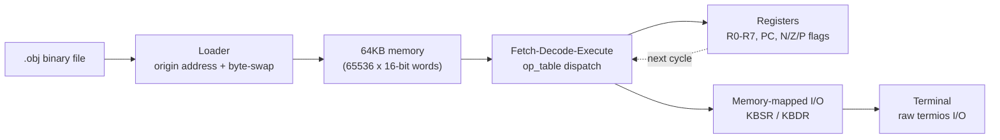

# 🖥️ A Computer in a Computer
*x14 engine — a bare-metal LC-3 virtual machine built from scratch in modern C++20*

    

> No operating system. No heap. No shortcuts — just 64KB of memory, eight registers, and a fetch–decode–execute loop pretending to be silicon.

*(Internally called **x14**; compiled here as the `lc3` binary.)*

---

### Contents
- [What is this, really?](#what-is-this-really)
- [Why this matters](#why-this-matters)
- [What it can actually do](#what-it-can-actually-do)
- [How it fits together](#how-it-fits-together)
- [Quick start](#quick-start)
- [Try it out: classic LC-3 programs](#try-it-out-classic-lc-3-programs)
- [What's next](#whats-next)
- [A note on how this got built](#a-note-on-how-this-got-built)
- [Acknowledgments](#acknowledgments)
- [License](#license)

---

## What is this, really?

Most developers never see a CPU directly. There's an operating system, a language runtime, maybe a JIT — layers of abstraction standing between "code" and "electricity." This project strips all of that away.

It's a software model of a real 16-bit computer: eight registers, a flat 64KB memory space, a fixed instruction set, and nothing else. Feed it a compiled `.obj` binary and it fetches, decodes, and executes each instruction the way physical LC-3 hardware would — including the inconvenient parts, like reading a keypress with no operating system around to hand it to you.

**LC-3** (Little Computer 3) is a small, teaching-oriented 16-bit ISA designed by Yale Patt and Sanjay Patel for *Introduction to Computing Systems* — one of the most widely used computer-organization textbooks in the world. It's simple enough to understand completely in a semester, but real enough that everything here (registers, condition flags, memory-mapped I/O, instruction dispatch) carries over directly to actual processor design.

## Why this matters

Every engineer eventually runs into a virtual machine — the JVM, a Python interpreter, a Docker container — but those are process-level abstractions sitting comfortably on top of an operating system. This project sits one level lower, with none of that scaffolding underneath it:

| | **x14** (this project) | JVM *(for comparison)* |
|---|---|---|
| Abstraction level | Hardware / silicon | Process / application |
| Execution model | Register-based, direct opcode dispatch | Stack-based bytecode interpreter |
| Memory | Fixed 64KB flat array, no heap | Managed heap + garbage collection |
| What it models | A physical CPU | A portable application runtime |

Both kinds of VM share the same basic idea — compile something high-level down into a binary format a small, fast engine can chew through — but the constraints are opposite. Working at the hardware level forces you to think in registers, flags, and raw bytes instead of objects and exceptions, which is exactly the muscle that computer-architecture and operating-systems courses are built to develop.

## What it can actually do

- **Executes real LC-3 machine code.** Loads big-endian `.obj` binaries (16-bit origin header + program image) and runs them directly — no OS, no interpreter shortcuts.
- **Implements the practical LC-3 instruction set** — arithmetic, control flow, and every addressing mode, decoded and executed entirely in software.
- **Real, live keyboard I/O.** Reconfigures the host terminal via `termios` (raw mode, no line buffering, no echo) and polls `stdin` non-blockingly, flipping the Keyboard Status Register (`KBSR`, address `0xFE00`) the same way real LC-3 hardware would.
- **Cycle-level stepping.** Every instruction is a single, deterministic `step()` call, so execution can be paused and inspected one cycle at a time.
- **O(1) instruction dispatch.** Opcodes resolve through a static function-pointer table (`op_table`) built with `template <unsigned op>` metaprogramming, instead of a 16-way `switch` — the same category of dispatch trick real interpreters and VMs use to avoid branch-heavy hot loops.
- **Fails safely, not silently.** Fatal execution errors unwind through `<stdexcept>` instead of a hard `std::exit()`, so the host terminal always gets restored to a sane state on the way out.
- **Verified, not just tested.** Core ALU behavior, register mutation, and memory transitions are checked with Catch2 by injecting hex values directly into memory — the test suite never touches disk I/O.

Supported opcodes:

| Category | Opcodes |
|---|---|
| Arithmetic / Logic | `ADD` `AND` `NOT` |
| Control Flow | `BR` `JMP` `JSR` `JSRR` |
| Load | `LD` `LDI` `LDR` `LEA` |
| Store | `ST` `STI` `STR` |
| System Calls | `TRAP` |

## How it fits together



```
LC3/
├── src/           VM engine — fetch-decode-execute loop, op_table, memory, I/O
├── tests/         Catch2 unit tests (in-memory verification, no disk I/O)
├── examples/      drop 2048.obj / rogue.obj here — see below
└── CMakeLists.txt
```

## Quick start

**Prerequisites:** Linux or macOS (the I/O layer relies on POSIX `termios`/`select()`, so Windows needs WSL), CMake, and a C++20-capable compiler (recent GCC or Clang both work).

```bash
# 1. Clone the repository
git clone https://github.com/steverse/LC3.git
cd LC3

# 2. Configure the build
mkdir build && cd build
cmake -DCMAKE_BUILD_TYPE=Release ..

# 3. Build and run the test suite (Catch2)
cmake --build . --target unit_tests
./unit_tests

# 4. Build and run the VM
cmake --build . --target lc3
./lc3 path/to/program.obj
```

## Try it out: classic LC-3 programs

The two programs almost everyone uses to test-drive an LC-3 VM are **`2048.obj`** (written by Ryan Pendleton) and **`rogue.obj`** (written by Justin Meiners), both originally built for the [*Write your own virtual machine*](https://www.jmeiners.com/lc3-vm/) tutorial. Grab them from the [tutorial's repository](https://github.com/justinmeiners/lc3-vm) (MIT licensed), drop them into an `examples/` folder at the project root, then run them like any other program image — from the project root:

```bash
./build/lc3 examples/2048.obj
./build/lc3 examples/rogue.obj
```

`2048` is a solid stress test for arithmetic and addressing modes; `rogue` leans harder on branching and live keyboard input.

## What's next

**ImpLC** is the planned next layer: a small imperative language (`.imp`) with its own compiler, targeting this VM's `.obj` format directly.

```
ImpLC source (.imp)  ->  ImpLC compiler  ->  LC-3 object code (.obj)  ->  x14
```

The interesting problems here are the ones any real compiler backend runs into: fitting variables into 8 registers, tracking condition-flag state across expressions, and staying inside a 16-bit address space.

Beyond that, the roadmap looks roughly like:

- [ ] Expand Catch2 coverage to every opcode and memory edge case
- [ ] Encapsulate registers and memory behind a real class boundary, out of raw globals
- [ ] CI via GitHub Actions — GCC + Clang, AddressSanitizer, UBSan
- [ ] An interactive CLI debugger — breakpoints, single-step, live register/memory inspection
- [ ] Stricter image-loading validation — file-size checks, origin bounds, endianness handling
- [ ] The ImpLC compiler front-end described above

x14 also doubles as the deterministic C++ scaffold for **xNULL**, a longer-running side exploration into reversible computing — architectures where every instruction has a well-defined inverse, so execution could in principle be stepped backward, not just forward. It's early and exploratory, but the long-term ambition is a formal write-up, ideally aimed at an IEEE-style venue.

## A note on how this got built

This started as coursework and turned into a proper systems project — built independently, mostly from the LC-3 spec and primary sources, with AI used only to unblock conceptual questions rather than to write the implementation. If you're a student reading this: getting the two's-complement sign-extension wrong, then figuring out why, is where most of the actual learning happens. There's no real shortcut for that part.

## Acknowledgments

- The LC-3 architecture was designed by Yale Patt and Sanjay Patel for *Introduction to Computing Systems*.
- `2048.obj` and `rogue.obj` come from Justin Meiners and Ryan Pendleton's [*Write your own virtual machine*](https://www.jmeiners.com/lc3-vm/) tutorial, MIT licensed.

## License

No license has been added to this repository yet — until then, all rights are reserved by default. Open an issue or reach out if you'd like to use or build on this work.
